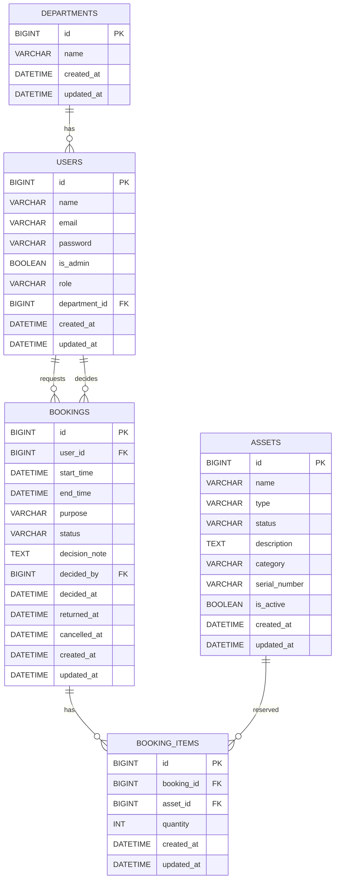

# SiPinjam — Portal Peminjaman Ruangan & Aset Kantor

Portal peminjaman ruangan rapat dan aset kantor (proyektor/laptop/dll) dengan kalender ketersediaan, approval admin, dan log/riwayat peminjaman.

Tech stack:
- Laravel 12
- MySQL
- FullCalendar.js

## Fitur Utama

- Availability Calendar (dinamis): kalender menampilkan booking **real-time via polling** (refetch tiap 30 detik).
- Status Approval: user mengajukan (pending), admin menyetujui/menolak (approved/rejected), status tampil di sisi user.
- Log Peminjaman: riwayat pengajuan/booking tersimpan dan terus bertambah.
- Validasi bentrok jadwal: mencegah dua user meminjam item yang sama pada jam yang sama.
- Notifikasi email: user otomatis menerima email ketika pengajuan disetujui/ditolak.

## Quick Start

1) Install dependencies
```bash
composer install
npm install
```

2) Setup env
```bash
copy .env.example .env
php artisan key:generate
```

3) Configure database (MySQL)

Edit `.env` (Laragon default):
```
DB_CONNECTION=mysql
DB_HOST=127.0.0.1
DB_PORT=3306
DB_DATABASE=sipinjam
DB_USERNAME=root
DB_PASSWORD=
```

4) Migrate + seed (dummy data)
```bash
php artisan migrate --seed
```

5) Run
```bash
php artisan serve
npm run dev
```

## Demo Accounts (Seeder)

- Admin
  - Email: `admin@sipinjam.test`
  - Password: `password`
- Approver/Manager
	- Email: `approver@sipinjam.test`
	- Password: `password`
- User
  - Email: `test@example.com`
  - Password: `password`

## Email (Notifikasi)

Untuk development yang paling gampang, gunakan mailer log:
```
MAIL_MAILER=log
```
Lalu cek output log Laravel saat admin approve/reject.

## ERD (Entity Relationship Diagram)



Catatan: versi terbaru memakai tabel `assets` (dengan `type=room|tool`) + `bookings` + `booking_items` untuk normalisasi dan validasi bentrok jadwal.
